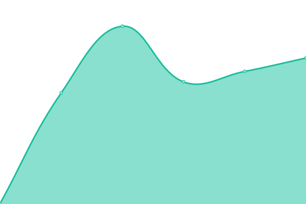
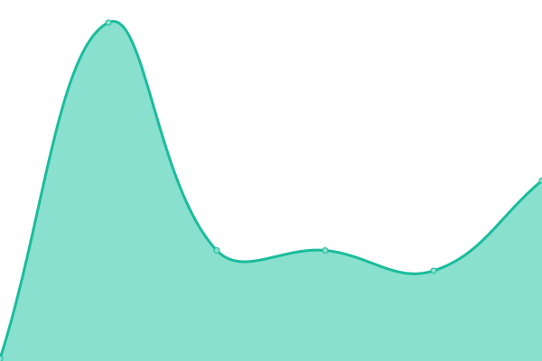

# [📈 Live Status](https://Danrrodrigues.github.io/site-monitor): <!--live status--> **🟧 Partial outage**

This repository contains the open-source uptime monitor and status page for [Danilo Rodrigues](https://Danrrodrigues.github.io/site-monitor), powered by [Upptime](https://github.com/upptime/upptime).

With [Upptime](https://upptime.js.org), you can get your own unlimited and free uptime monitor and status page, powered entirely by a GitHub repository. We use [Issues](https://github.com/Danrrodrigues/site-monitor/issues) as incident reports, [Actions](https://github.com/Danrrodrigues/site-monitor/actions) as uptime monitors, and [Pages](https://Danrrodrigues.github.io/site-monitor) for the status page.

<!--start: status pages-->
<!-- This summary is generated by Upptime (https://github.com/upptime/upptime) -->
<!-- Do not edit this manually, your changes will be overwritten -->
<!-- prettier-ignore -->
| URL | Status | History | Response Time | Uptime |
| --- | ------ | ------- | ------------- | ------ |
|  [Angélica Andrade - Site Principal](https://angelicaandrade.com.br) | 🟩 Up | [angelica-andrade-site-principal.yml](https://github.com/Danrrodrigues/site-monitor/commits/HEAD/history/angelica-andrade-site-principal.yml) | 

 470ms
     
 | 

<a href="https://Danrrodrigues.github.io/site-monitor/history/angelica-andrade-site-principal">100.00%</a>
    

|  [Angélica Andrade - Blog](https://angelicaandrade.com.br/blog) | 🟥 Down | [angelica-andrade-blog.yml](https://github.com/Danrrodrigues/site-monitor/commits/HEAD/history/angelica-andrade-blog.yml) | 

 83ms
     
 | 

<a href="https://Danrrodrigues.github.io/site-monitor/history/angelica-andrade-blog">0.26%</a>
    

|  [Repositório GitHub](https://github.com/Danrrodrigues/angelicaandrade) | 🟥 Down | [repositorio-git-hub.yml](https://github.com/Danrrodrigues/site-monitor/commits/HEAD/history/repositorio-git-hub.yml) | 

 283ms
     
 | 

<a href="https://Danrrodrigues.github.io/site-monitor/history/repositorio-git-hub">0.00%</a>
    

<!--end: status pages-->

[**Visit our status website →**](https://Danrrodrigues.github.io/site-monitor)

## 📄 License

- Powered by: [Upptime](https://github.com/upptime/upptime)
- Code: [MIT](./LICENSE) © [Anand Chowdhary](https://anandchowdhary.com), supported by [Pabio](https://pabio.com)
- Data in the `./history` directory: [Open Database License](https://opendatacommons.org/licenses/odbl/1-0/)
