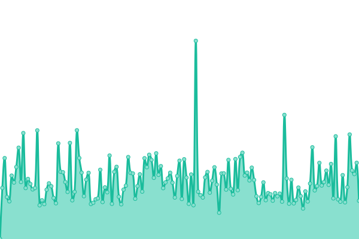
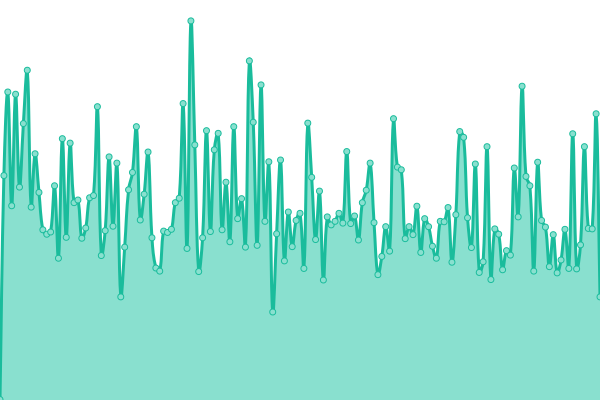
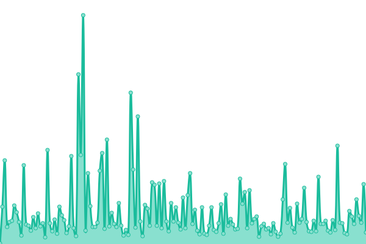
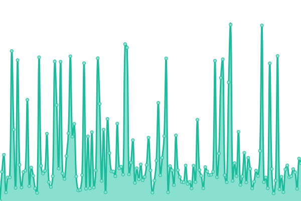
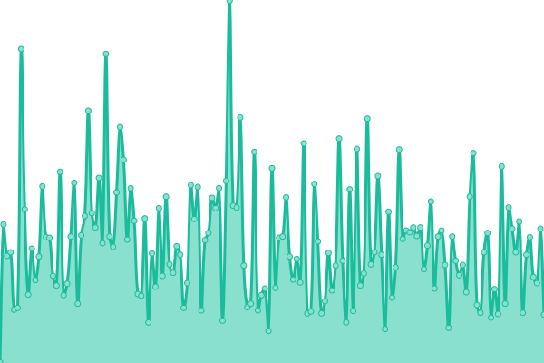

# [📈 Live Status](https://Danrrodrigues.github.io/site-monitor): <!--live status--> **🟩 All systems operational**

This repository contains the open-source uptime monitor and status page for [Danilo Rodrigues](https://Danrrodrigues.github.io/site-monitor), powered by [Upptime](https://github.com/upptime/upptime).

With [Upptime](https://upptime.js.org), you can get your own unlimited and free uptime monitor and status page, powered entirely by a GitHub repository. We use [Issues](https://github.com/Danrrodrigues/site-monitor/issues) as incident reports, [Actions](https://github.com/Danrrodrigues/site-monitor/actions) as uptime monitors, and [Pages](https://Danrrodrigues.github.io/site-monitor) for the status page.

<!--start: status pages-->
<!-- This summary is generated by Upptime (https://github.com/upptime/upptime) -->
<!-- Do not edit this manually, your changes will be overwritten -->
<!-- prettier-ignore -->
| URL | Status | History | Response Time | Uptime |
| --- | ------ | ------- | ------------- | ------ |
|  [Angélica Andrade (www)](https://www.angelicaandrade.com.br) | 🟩 Up | [angelica-andrade-www.yml](https://github.com/Danrrodrigues/site-monitor/commits/HEAD/history/angelica-andrade-www.yml) | 

 628ms
     
 | 

<a href="https://Danrrodrigues.github.io/site-monitor/history/angelica-andrade-www">100.00%</a>
    

|  [Angélica Andrade (sem www)](https://angelicaandrade.com.br) | 🟩 Up | [angelica-andrade-sem-www.yml](https://github.com/Danrrodrigues/site-monitor/commits/HEAD/history/angelica-andrade-sem-www.yml) | 

 427ms
     
 | 

<a href="https://Danrrodrigues.github.io/site-monitor/history/angelica-andrade-sem-www">100.00%</a>
    

|  [Angélica Andrade - Link Bio](https://www.angelicaandrade.com.br/link-bio) | 🟩 Up | [angelica-andrade-link-bio.yml](https://github.com/Danrrodrigues/site-monitor/commits/HEAD/history/angelica-andrade-link-bio.yml) | 

 57ms
     
 | 

<a href="https://Danrrodrigues.github.io/site-monitor/history/angelica-andrade-link-bio">100.00%</a>
    

|  [Danilo Rodrigues (www)](https://www.danilorodrigues.me) | 🟩 Up | [danilo-rodrigues-www.yml](https://github.com/Danrrodrigues/site-monitor/commits/HEAD/history/danilo-rodrigues-www.yml) | 

 263ms
     
 | 

<a href="https://Danrrodrigues.github.io/site-monitor/history/danilo-rodrigues-www">100.00%</a>
    

|  [Danilo Rodrigues (sem www)](https://danilorodrigues.me) | 🟩 Up | [danilo-rodrigues-sem-www.yml](https://github.com/Danrrodrigues/site-monitor/commits/HEAD/history/danilo-rodrigues-sem-www.yml) | 

 210ms
     
 | 

<a href="https://Danrrodrigues.github.io/site-monitor/history/danilo-rodrigues-sem-www">100.00%</a>
    

|  [Intelinegocio (vercel)](https://intelinegocio.vercel.app) | 🟩 Up | [intelinegocio-vercel.yml](https://github.com/Danrrodrigues/site-monitor/commits/HEAD/history/intelinegocio-vercel.yml) | 

 190ms
     
 | 

<a href="https://Danrrodrigues.github.io/site-monitor/history/intelinegocio-vercel">100.00%</a>
    

<!--end: status pages-->

[**Visit our status website →**](https://Danrrodrigues.github.io/site-monitor)

## 📄 License

- Powered by: [Upptime](https://github.com/upptime/upptime)
- Code: [MIT](./LICENSE) © [Anand Chowdhary](https://anandchowdhary.com), supported by [Pabio](https://pabio.com)
- Data in the `./history` directory: [Open Database License](https://opendatacommons.org/licenses/odbl/1-0/)
